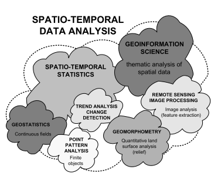
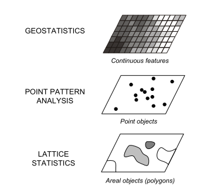

# Analisis Spasial dan Temporal

Proses-proses analisis data spatio-temporal (STDA/ *Spatio-temporal Data Analysis*) menggabungkan dua disiplin ilmu, yakni *geoinformation science* dan *spatio-temporal statistics*. Dapat disederhanakan dalam bentuk matematika sebagai STDA = GIS + *statistics*. Sedangkan proses-proses dalam spatio-temporal diantaranya termasuk *image processing*, analisis pola titik, geostatistik, dan geomorfometri (Hengl, 2009).

Disiplin ilmu geostatistik merupakan irisan atau sebagian dari metode analisis dan interpretasi data geografi dengan spesialisasinya pada cara-cara statistika (Goovaerts, 1997 dalam Hengl, 2009). Dua metode lain yang digunakan untuk analisis data spasial yakni analisis pola titik (*point pattern analysis*) dengan objek titik, serta statistika *lattice* dengan objek poligon diskrit (Cressie, 1993 dalam Hengl, 2009).

Suatu data atau objek pengukuran dapat dikategorikan sebagai spatio-temporal setidaknya ditentukan oleh empat parameter (Hengl, 2009), yakni:

1. Lokasi geografis (longitude dan latitude, atau proyeksi koordinat x, y)
2. Ketinggian di atas permukaan tanah (elevasi)
3. Waktu pengukuran (tahun, bulan, hari, jam, menit, dan lain-lain)
4. Besaran yang diukur

Jika tanpa parameter waktu, maka hanya menjadi analisis spasial. Analisis spasial merupakan proses manipulasi informasi spasial. Proses analisis ini dilakukan guna mengembangkan data pengukuran dan/ atau perhitungan yang orisinil menjadi informasi baru yang memiliki arti. Melalui proses tersebut diharapkan dapat diambil sebuah keputusan.

Sebagai sebuah metode, analisis spasial berusaha untuk membantu penggunanya menganalisis kondisi dalam suatu permasalahan berdasarkan data dari wilayah yang menjadi sasaran. Konsep-konsep yang mendasari sebuah analisis spasial adalah jarak, arah, dan hubungan. Kombinasi dari ketiganya akan bervariasi pada setiap wilayah yang berbeda sehingga membentuk karakteristik yang unik (Cholid, 2009:5). (*Rujukan:* [web, cari buku/jurnalnya](https://iam-ismail.blogspot.com/2011/09/konsep-analisis-spasial-untuk.html))

Pada studi hidrologi, penekanan dilakukan pada pentingnya analisis terrain dan pemodelan hidrologi yang biasanya berupa pemodelan perpindahan atau pergerakan air di muka bumi. Penerapannya pada bidang ilmu teknik sipil dapat ditemui pada pemodelan banjir, reservoir, dan lain sebagainya.

### 1. Lokasi Geografis

Proyeksi, datum

### 2. Ketinggian

Ketinggian di atas muka tanah dewasa ini diwakili dengan data elevasi digital yang disebut Digital Elevation Model (DEM). 

Indonesia sendiri memiliki otoritas penyedia data ketinggian yakni diantaranya, jika bukan satu-satunya, Badan Informasi Geologi (BIG). DEM dari BIG dinamakan dengan DEMNAS.

Berdasarkan informasi dari Badan Informasi Geologi (BIG), Digital Elevation Model (DEM) Nasional atau disingkat dengan DEMNAS dibangun dari beberapa sumber data yang meliputi data IFSAR (resolusi 5m), TERRASAR-X (resolusi 5m) dan ALOS PALSAR (resolusi 11.25m), dengan menambahkan data Masspoint hasil *stereo-plotting*. Resolusi spasial DEMNAS adalah 0.27-arcsecond, dengan menggunakan datum vertikal EGM2008.

Sumber: [BIG](http://tides.big.go.id/DEMNAS/)

## Pendekatan Geostatistik dalam Analisis Spasial

Pada berbagai program aplikasi SIG disediakan piranti untuk perhitungan interpolasi, baik dengan nama penganalisis spasial (*spatial analyst*) maupun penganalisis geostatistik (*geostatistical analyst*). Sebagian besar metode interpolasi yang tersedia dalam *spatial analyst* direpresentasikan pula dalam *geostatistical analyst*. Namun pada *geostatistical analyst* terdapat lebih banyak model-model statistik dan perkakas (*tool*) statistik, yangmana semua itu bisa digunakan untuk memanipulasi parameter-parameter spasial untuk memperoleh *surface* yang optimum.

Geostatistik adalah jenis analisis statistik spasial. Pada metode Kriging misalnya, teknik geostatistik yang lebih dari sekadar cara interpolasi biasa. Teknik Kriging tidak hanya melihat nilai dari data terdekat secara matematis atau statistik biasa ketika memprediksi nilai yang belum diketahui. Lebih dari itu, Kriging menggunakan hubungan spasial dari titik-titik teramati untuk memberikan prediksi yang lebih akurat.

Konsep *geostatistical analyst* pada aplikasi SIG memperluas jumlah metode interpolasi deterministik dan geostatistik serta memberikan banyak pilihan tambahan padanya.

In particular, Geostatistical Analyst provides a variety of different output surfaces such as prediction, probability, quantile, and error of predictions. Surfaces can be displayed as grids, contours, filled contours, and hillshades or any combination of these renderings. ArcGIS Geostatistical Analyst also includes an interactive set of exploratory spatial data analysis tools for exploring the distribution of the data, identifying local and global outliers, looking for global trends, and understanding spatial dependence in the data.

Sumber: [ESRI melalui GIS StackExchange](https://gis.stackexchange.com/questions/45316/difference-between-geostatistical-analyst-and-spatial-analyst-toolboxes-for-inte) dan juga dari [wawancara dengan Lauren Scott](https://www.esri.com/news/arcwatch/0410/lauren-scott.html) dari ESRI.

Lihat [Spasial Statistik](https://docs.qgis.org/2.18/en/docs/training_manual/vector_analysis/spatial_statistics.html?highlight=spatial%20analysis) untuk tutorial menggunakannya

# Interpolasi Curah Hujan

Metode yang digunakan dalam analisis spasial sangat bervariasi, mulai dari observasi visual sampai ke pemanfaatan matematika atau statistika terapan.

Interpolasi pada besaran curah hujan terukur di stasiun hujan menghasilkan sebaran curah hujan atau distribusi curah hujan.

Interpolasi spasial adalah proses penggunaan titik-titik yang telah diketahui nilainya untuk mengestimasi nilai-nilai pada titik lain yang belum diketahui. Sebagai contoh, untuk membuat sebuah peta sebaran hujan pada suatu area, tidak cukup dengan hanya menggunakan data besaran hujan pada stasiun pengamatan cuaca saja. Meskipun stasiun pengamat banyak tersebar di penjuru wilayah, namun hanya merupakan data titik yang bersifat diskrit. Hujan yang terukur bukan terjadi pada seluruh luasan wilayah tersebut.

Interpolasi spasial dapat mengestimasi besaran hujan dan parameter hidrologi lain untuk berbagai lokasi yang tidak memiliki data rekaman. Caranya dengan menggunakan hasil bacaan hujan yang telah diketahui pada lokasi pengamatan yang berada di dekatnya.

Gambar: Peta interpolasi temperatur dari stasiun-stasiun pengamat cuaca di Afrika Selatan.

Tipe interpolasi demikian sering disebut sebagai *statistical surface*. Data elevasi, presipitasi, akumulasi hujan/ salju, muka air, dan kepadatan populasi merupakan tipe-tipe data yang bisa dihitung menggunakan cara interpolasi.

Oleh sebab tingginya biaya dan keterbatasan sumberdaya, pengumpulan data biasanya *conducted* hanya pada titik-titik lokasi dengan jumlah terbatas. Pada SIG, titik-titik tersebut dapat digunakan untuk estimasi dalam proses interpolasi spasial sehinga menghasilkan sebuah *raster surface* yang baru.

Berdasarkan keperluan untuk menghasilkan sebuah peta kontinu, metode interpolasi yang sesuai harus digunakan untuk mengoptimalkan estimasi nilai-nilai pada lokasi pengamatan yang tidak memiliki sampel data. Hasil analisis interpolasi tersebut kemudian dapat digunakan untuk menganalisis seluruh area yang diamati dan untuk keperluan pemodelannya.

## Macam-Macam Metode Interpolasi

Secara garis besar, metode interpolasi yang umum digunakan dalam berbagai kajian dapat diklasifikasikan menjadi tiga, yaitu (Hadi, Bambang S., 2013):

1. metode interpolasi global dan lokal,
2. metode interpolasi eksak dan non-eksak, serta
3. metode interpolasi determenistik dan stokastik.

**Interpolasi Global dan Lokal**

Interpolasi global menggunakan semua titik kontrol yang tersedia. Cukup memadai untuk diterapkan pada medan yang tidak menunjukkan variasi yang kompleks. Interpolasi ini memiliki asumsi bahwa autokorelasi spasial bernilai baik pada skala regional. Estimasi yang diperoleh lebih bersifat umum. Contoh penggunaan interpolasi global dengan *trend surface* orde pertama (polinomial).

Interpolasi lokal hanya menggunakan sampel titik-titik kontrol. Metode ini sesuai untuk medan yang menunjukkan variasi yang kompleks. Asumsi dari metode ini adalah autokorelasi spasial bernilai baik pada skala lokal. Nilai-nilai hasil estimasi lebih bersifat lokal. Prosedur umum untuk mengidentifikasi titik-titik akan destinasi mencakup langkah-langkah berikut:

(1) Sebuah wilayah pencarian (bertetanggan) didefinisikan sekitar titik;

(2) Titik-titik sampel dalam area penelitian diidentifikasi;

(3) Sebuah fungsi matematika yang dipilih untuk memodelkan variasi lokal antara titik-titik;

(4) Nilai data untuk titik diperkirakan dari fungsi.

Interpolasi lokal setidaknya dapat dilakukan melalui beberapa cara, antara lain dengan tren (polinomial) lokal, poligon Thiessen (metode proximal), estimasi kepadatan, Inverse Distance Weighting (IDW), dan Radial Basis Function (RBF) Splines.

**Interpolasi Eksak dan Non-eksak**

Interpolasi eksak merupakan cara memprediksi nilai pada titik kontrol yang sama dengan nilai yang diobservasi. Interpolasi ini menghasilkan permukaan yang lewat titik kontrol. Sedangkan interpolasi non-eksak digunakan untuk memprediksi nilai untuk titik kontrol yang berbeda dari nilai yang diamati.

**Interpolasi Deterministik dan Stokastik**

Interpolasi deterministik tidak ada penilaian kesalahan dengan nilai prediksi. Contoh model determenistik sederhana adalah Inverse Distance Weighted (IDW). Asumsi dari metode IDW adalah nilai interpolasi akan lebih mirip pada data sampel yang berdekatan lokasinya daripada data yang lokasinya lebih jauh.

Berikut merupakan beberapa metode interpolasi yang biasa digunakan:

- Trend (Polinomial)
- Poligon Thiessen
- Inverse Distance Weighting (IDW)
- Radial Basis Function (RBF) Splines
- Triangulated Irregular Networds (TIN)
- Regularized Splines with Tension (RST)
- Local Polynomial Interpolation (LPI)
- Kriging
  - Ordinary Kriging (OK)
  - Empirical Bayes kriging (EBK)

## Prosedur Pemilihan Metode

Penting untuk diingat bahwa tidak ada satu metode interpolasi tertentu yang bisa diterapkan untuk seluruh kondisi. Metode satu dengan yang lain meiliki kelebihan dan kekurangan masing-masing. Pada praktiknya, pemilihan sejumlah metode harus berdasarkan pada data sampel, tipe diagram pada peta (*surface*) yang akan dibuat, serta toleransi galat pada estimasi. Secara umum, tiga langkah atau prosedur yang disarankan adalah sebagai berikut:

1. **Mengevaluasi data sampel**, dilakukan untuk memperoleh ide mengenai cara data didistribusikan pada area yang diamati. Langkah ini memungkinkan peneliti untuk dapat memperoleh petunjuk tentang metode interpolasi mana yang akan digunakan.
2. **Gunakan metode interpolasi yang paling sesuai** baik dengan data sampel maupun dengan tujuan studi dilakukan (*study objectives*). Ketika sulit ditemukan metode yang cocok, boleh juga dilakukan percobaan terhadap beberapa metode yang tersedia.
3. **Membandingkan hasil yang diperoleh** dari berbagai anlisis yang telah diterapkan. Melalui perbandingan tersebut dapat ditemukan hasil terbaik dan metode yang paling sesuai.

Sumber: [QGIS' dok](https://docs.qgis.org/2.18/en/docs/gentle_gis_introduction/spatial_analysis_interpolation.html?highlight=spatial%20analysis)

Kesimpulan

- **Interpolation** uses vector points with known values to estimate values at unknown locations to create a raster surface covering an entire area.
- The interpolation result is typically a **raster** layer.
- It is important to **find a suitable interpolation method** to optimally estimate values for unknown locations.
- **IDW interpolation** gives weights to sample points, such that the influence of one point on another declines with distance from the new point being estimated.
- **TIN interpolation** uses sample points to create a surface formed by triangles based on nearest neighbour point information.

Link: [tutorial interpolasi data titik (vektor)](http://www.qgistutorials.com/id/docs/interpolating_point_data.html)